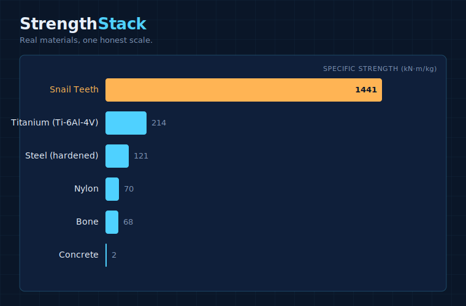

# Strength Stack

**▶ Live demo: [apps.charliekrug.com/strength-stack](https://apps.charliekrug.com/strength-stack/)**

[](https://github.com/ctkrug/strength-stack/actions/workflows/ci.yml)
[](LICENSE)

**See which materials are strongest for their weight.** Drag spider silk,
snail teeth, kevlar, bone, or steel onto one chart and watch it rescale and
re-sort live.



Strength Stack puts real materials-science data on one comparable scale,
**specific strength** (tensile strength per unit weight), so you can drop any
material onto the chart and see how it stacks up against the rest. No
engineering background required.

## Why specific strength

Materials scientists compare strength to weight with [Ashby charts](https://en.wikipedia.org/wiki/Material_selection#Ashby_charts):
powerful, but built for engineers in CAD software, not curious readers. There
isn't a version of this comparison for someone who just wants to know "wait,
is snail teeth really stronger than steel?" and watch the answer prove itself
on screen. Strength Stack is that version. Drag, drop, rescale, done.

## The wow moment

Drag **snail teeth** (limpet radula, the strongest natural material ever
measured) onto a chart seeded with ordinary steel. The scale rescales live,
snail teeth pops to the top with a celebratory amber highlight, and steel, the
material everything else usually gets measured against, visibly shrinks next
to it.

Keep going and the ranking gets more surprising. Add kevlar or carbon fiber
and they climb straight past snail teeth, because for their weight the
synthetic fibers beat everything else in the set.

## How it works

Every material carries two real physical properties:

- **Tensile strength** (MPa): how much pulling force it takes to break.
- **Density** (kg/m³): how much it weighs for its size.

Strength Stack divides one by the other to get **specific strength** (tensile
strength ÷ density), the number that answers "how strong is this material once
you account for how heavy it is?" That single value is the axis every material
gets plotted on, so a lightweight fiber and a dense metal are finally
comparable at a glance.

## Features

- Drag-and-drop material chips onto a live, animated D3 chart. Mouse and touch
  both work through one Pointer Events implementation, and tap or keyboard
  (Tab, then Enter or Space) place a material too, no drag required.
- Specific-strength ranking that rescales and re-sorts as materials are added
  or removed, for the full 12-material dataset in any order.
- A curated dataset spanning natural and synthetic materials: steel, bone,
  spider silk, kevlar, carbon fiber, snail teeth, and more.
- A celebratory highlight and a synth chime when a dragged material takes the
  top spot, with a persistent mute toggle and full `prefers-reduced-motion`
  support.
- Live-region announcements and managed focus, so the whole interaction works
  without a mouse.
- A static, shareable, mobile-friendly build with no backend.

## Stack

- **TypeScript** for the app and data layer.
- **D3** for the chart rendering and transitions.
- **Vite** for bundling and local dev.
- **Vitest** for unit tests, with **fast-check** for property-based tests of
  the specific-strength and ranking logic.

## Development

```bash
npm install
npm run dev       # local dev server
npm test          # run the test suite
npm run build     # production build to site/
```

## Documentation

- [`docs/VISION.md`](docs/VISION.md): the product concept and design goals.
- [`docs/ARCHITECTURE.md`](docs/ARCHITECTURE.md): how the code is organized.
- [`docs/DESIGN.md`](docs/DESIGN.md): the visual direction and tokens.
- [`docs/BACKLOG.md`](docs/BACKLOG.md): ideas not yet built.

## CI gate

Every push and pull request runs [`.github/workflows/ci.yml`](.github/workflows/ci.yml):
`npm run lint`, `npm run test:coverage` (which fails if coverage drops below
the thresholds in `vitest.config.ts`), and `npm run build`, in that order. A
red run on `main` is a stop-the-line signal: fix forward before adding new
work, don't build on top of a broken commit.

## License

MIT. See [LICENSE](LICENSE).

---

More of Charlie's projects → [apps.charliekrug.com](https://apps.charliekrug.com)
